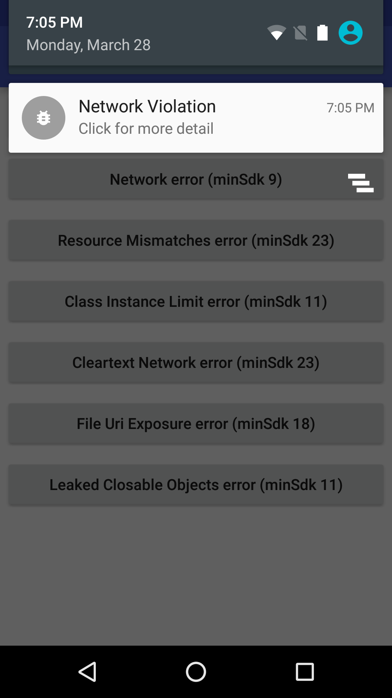
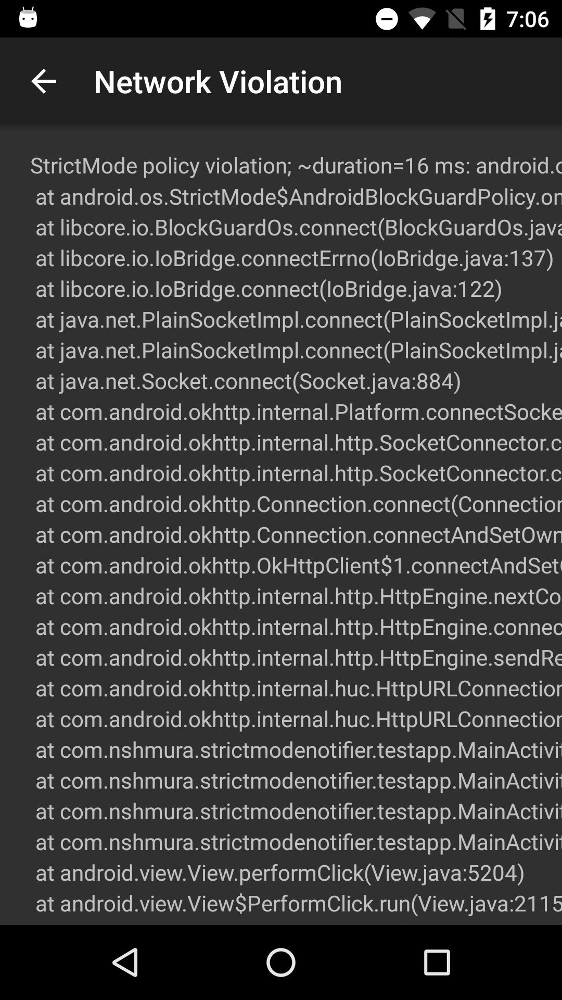
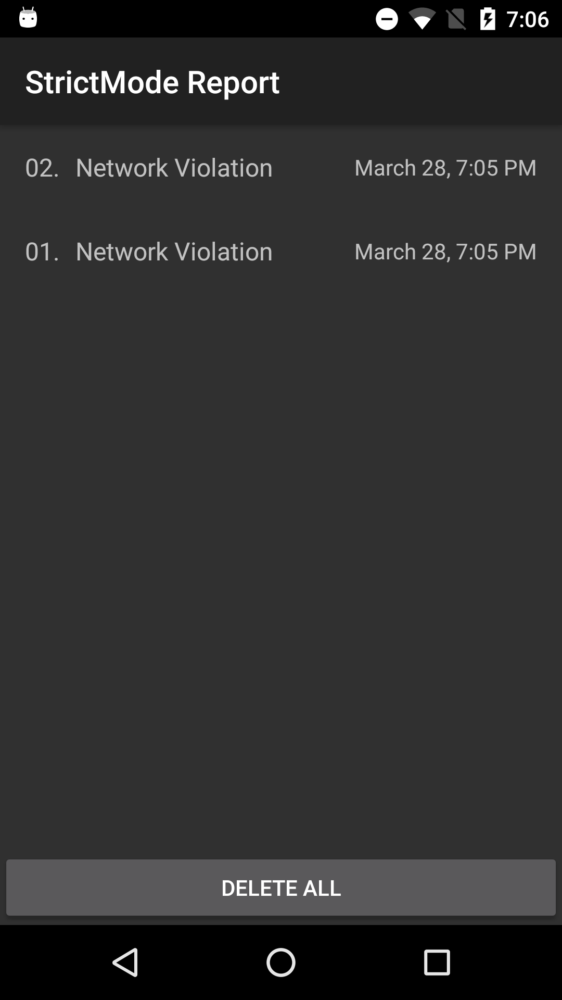
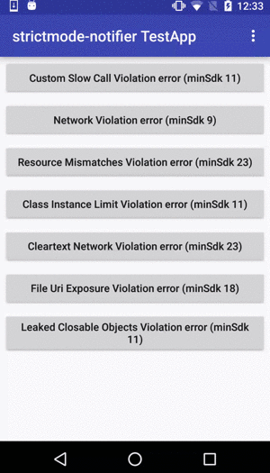

# strictmode-notifier
[](http://androidweekly.net/issues/issue-200)
[](https://android-arsenal.com/details/1/3405)

## Origins
Forked from [original repo](https://github.com/nshmura/strictmode-notifier) because it was no longer mantained

An Android library that improves the StrictMode reporting.

- *Head-up Notification* of StrictMode violations.
- *Ignoring Specific Violations*
- *Custom Actions* that called when StrictMode violations is happend.
- *Violation History Viewer* that automatically installed. <br> 

## Screenshots




## Sample App
[strictmode-notifier/testapp](https://github.com/nshmura/strictmode-notifier/tree/master/testapp)

<br>

## About StrictMode
- [StrictMode for Runtime Analysis on Android](https://medium.com/google-developers/strictmode-for-runtime-analysis-on-android-f8d0a2c5667e#.elffd4gi1)
- [StrictMode for enforcing best practices at runtime](https://www.youtube.com/watch?v=BxTfwT7mkB4)

## Getting started

In your `build.gradle`:

```gradle
 repositories {
    jcenter()
 }

 dependencies {
    implementation 'com.juanimoli.strictmode:notifier:1.0.0'
 }
```

In your `Application` class:

```java
public class ExampleApplication extends Application {

  @Override public void onCreate() {
    super.onCreate();
    
    if (BuildConfig.DEBUG) {
      //setup this library
      StrictModeNotifier.install(this);

      //setup StrictMode.
      // 
      // penaltyLog() should be called for strictmode-notifier
      //
      new Handler().post(new Runnable() {
        @Override public void run() {
          StrictMode.ThreadPolicy threadPolicy = new StrictMode.ThreadPolicy.Builder()
              .detectAll()
              .permitDiskReads()
              .permitDiskWrites()
              .penaltyLog() // Must!
              .build();
          StrictMode.setThreadPolicy(threadPolicy);

          StrictMode.VmPolicy vmPolicy = new StrictMode.VmPolicy.Builder()
              .detectAll()
              .penaltyLog() // Must!
              .build();
          StrictMode.setVmPolicy(vmPolicy);
        }
      });
    }
  }
}
```

## How does it work?
1. `notifier` starts `logcat`  command in backgound thread, and infinitely reads the log from `logcat`.
2. If StrictMode violation is happend, error logs is outputed.
3. `notifier` reads that log via `logcat`, and shows a notification of the violation.

## Customizing

### How to ignore specific violations

```java
StrictModeNotifier
    .install(context)
    .setIgnoreAction(new IgnoreAction() {
      @Override public boolean ignore(StrictModeViolation violation) {
        // ex) ignore LEAKED_CLOSABLE_OBJECTS that contains android.foo.bar in stacktrace.
        return violation.violationType == ViolationType.LEAKED_CLOSABLE_OBJECTS
            && violation.getStacktraceText().contains("android.foo.bar");
      }
    });
```

### How to add custom actions

```java
StrictModeNotifier
    .install(context)
    .addCustomAction(new CustomAction() {
      @Override public void onViolation(StrictModeViolation violation) {
        //ex) Send messages into Slack
      }
    });
```

### How to disable Headup Notification

```java
StrictModeNotifier
    .install(context)
    .setHeadupEnabled(false);
```

### How to enable debug mode of strictmode-notifier

```java
StrictModeNotifier
    .install(context)
    .setDebugMode(true);
```

## Todo
Parsing following violations
- ActivityLeaks
- LeakedRegistrationObjects
- LeakedSqlLiteObjects

## Thanks
Inspired by [square/leakcanary](https://github.com/square/leakcanary)

## License
```
Copyright (C) 2016 nshmura

Licensed under the Apache License, Version 2.0 (the "License");
you may not use this file except in compliance with the License.
You may obtain a copy of the License at

http://www.apache.org/licenses/LICENSE-2.0

Unless required by applicable law or agreed to in writing, software
distributed under the License is distributed on an "AS IS" BASIS,
WITHOUT WARRANTIES OR CONDITIONS OF ANY KIND, either express or implied.
See the License for the specific language governing permissions and
limitations under the License.
```
